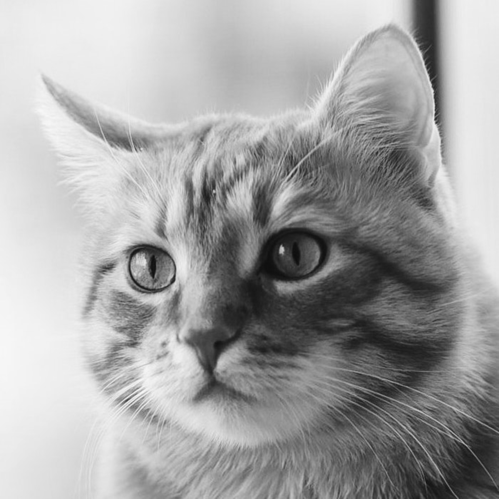

# Image To Dice
_Convert any image to dice, grayscale, or a simplified grayscale_


## Command Line Arguments:
#### _Must specifiy all args with a value or -1 (Default)_
#### _Otherwise all default settings will be used_
```Bash
    1) path/file_name (Default: my_picture.png)
    2) path/output_folder (Default: ./out)
    3) Type of change (G: Grayscale, S: Simple Grayscale, D: Dice - Default)
    4) Size (Default 1000x1000)
    5) Invert (-1: Black on White, 1: White on Black, Default: -1)
```

## Example Use Cases
```Bash
# Edit cat picture, save to dir ./cat_pics, set it to grayscale, 100x100px image, not inverted
processing-java --sketch=`pwd` --run ./cat.png ./cat_pics G 100 -1
```
```Bash
# All default settings
processing-java --sketch=`pwd` --run
```

## Example Output
_Image curtosy of [pexels.com](https://www.pexels.com/photo/selective-focus-photography-of-orange-tabby-cat-1170986/)_

### Input: `examples/cat.png`


### Dice: `examples/cat_dice_1500x1500.png`
`processing-java --sketch=`pwd` --run ./examples/cat.png ./examples -1 1500 -1`


### Grayscale: `examples/cat_grayscale_1500x1500.png`
`processing-java --sketch=`pwd` --run ./examples/cat.png ./examples G 1500 -1`




### Simple Grayscale `examples/cat_simple_grayscale_1500x1500.png`
`processing-java --sketch=`pwd` --run ./examples/cat.png ./examples S 1500 -1`


### Dice (Inverted) `examples/cat_dice_inverted.png`

`processing-java --sketch=`pwd` --run ./examples/cat.png ./examples -1 1500 1`


